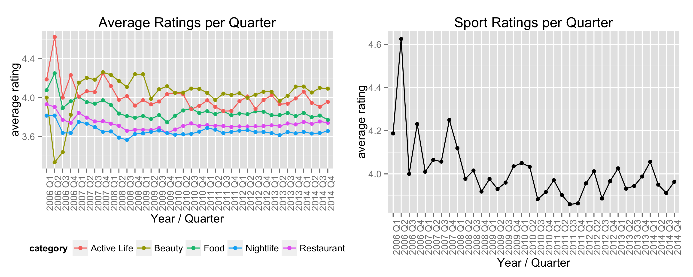

<<<<<<< HEAD
Yelp Dataset Challenge - Identifying Review Patterns
=======
Yelp Dataset Challenge: Review Patterns
>>>>>>> master
========================================================
author: Christoph Fabianek
date: Sunday, November 22nd, 2015

Introduction
========================================================

<<<<<<< HEAD
Do businesses (in the same or in different geographic locations / with same or different categories) share review patterns (stars, number of reviews, number of tips) over time? I want to find out if and how well it is possible to predict ratings for a business based on existing yelp reviews from other businesses.

Methods
========================================================

describe approach

Results
========================================================

what did we learn
=======
* Coursera Data Science Capstone Project
    - using data from the *Yelp Dataset Challenge*
* Primary Question:   
    *Do seasonal review patterns exists in the Yelp Dataset?*

Methods
========================================================

Some Yelp categories show patterns in average quarterly ratings.  

A T-Test shall answer the question if those patterns for Yelp sports categories have a significant relation to the time of the year (season).

Results
========================================================

**Null Hypothesis $H_0$**:  
The season (time of the year) has no effect on sports activity ratings.  

**T-Test Result**:
<table>
 <thead>
  <tr>
   <th style="text-align:right;"> p.value </th>
   <th style="text-align:right;"> CI.low </th>
   <th style="text-align:right;"> CI.high </th>
  </tr>
 </thead>
<tbody>
  <tr>
   <td style="text-align:right;"> 0 </td>
   <td style="text-align:right;"> 0.2318871 </td>
   <td style="text-align:right;"> 0.3342908 </td>
  </tr>
</tbody>
</table>

**Interpretation**:  
the confidence interval does not contain 0 and the p-value is less than 5% so $H_0$ can be rejected

>>>>>>> master

Discussion
========================================================

<<<<<<< HEAD
where to go from here
=======
**Answer to the primary question:**  
The season has an effect on sports activity ratings. 

**Interpretation:**  
Ratings are higher at the begin of the year (maybe this is releated to New Year's resolutions  / positive spirit on starting a new activity)

**Assumptions for T-Test:**  

* experiment was done with a random assignment of participants
* the sample ratings are representative for the overall population 

>>>>>>> master
